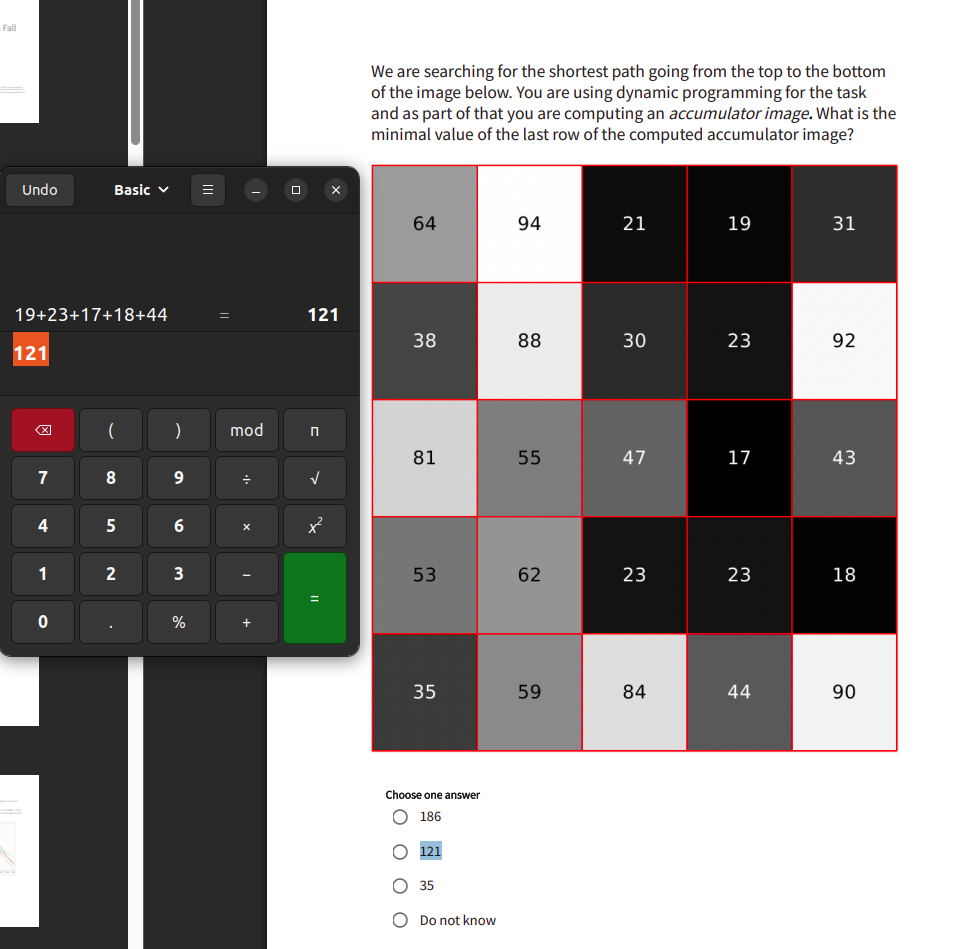

**Standard prompt**

Please solve this question with python code. You do not have access to the correct files, but please also include how to load files. 

----

**GENERAL OBSERVATIONS**
- IT IS IMPORTANT TO VERIFY THAT ALL THE CODE IS THERE!!!!!!! 
- CONSIDER TO INCLUDE PROMPTS!

**BLOBS**
- Working filtering blobs, remember to experiment with areas sice when finding the segmentation

---

**LDA Analysis**
- Be aware of the colors and that they are correct!
- If asked to calculate hyperplane remember class value - threashold = result

---

**PCA**
- Be aware of the delimiter!
- Look at the exam set, if the images are in colour, do not gray scale
- Load the first image and based off of that determine the image size **(do not auto rezise)**
- If you need to find SSD (pixelwise sum of squared differences) between two images remember to use .flatten() on the images 
---

**Gradient decent**
- Extract the cost function seperatly to secure it is using the correct function
- Get chat to plot the iterations (the images)
- Ask it to start at the green dots when figuring out the amount of iterations

---

**Classification**
- Manually verify which ROI combination were used to create the segmentation
- For optiomal threshold between two ROI classes ask chat to use brute-force calculations
- If you need to find the class range, it is often [0,#] with the # being the threshold. 

---

**3D Registration - .gz files**
- Use the following methods from combined: quick_show_orthogonal, rotation_matrix, quick_overlay_slices, quick_calculate_rigid_geometric_tranformation
- IMPORTANT! Use transform.SetMatrix(R.T.flatten()) NOT transform.SetMatrix(R.flatten())

---

**Hough transformation**
- If you are asked to 'Which of the sets of Hough-space point sets (Theta, Rho) represent the
green matchstick person?' just give chat the starting coordinate points and ask it to calculate. No code
- If you need to calculate moving images and the points are inbetween they are ,5 intervals. 

---
**Otus**
- Remember to use float to get the correct threshold.

---
**Two Hough space sinograms crossing**
- Print it in python and see what 2 lines are crossing

---
**accumulator image**
From the top select the sorthest path
